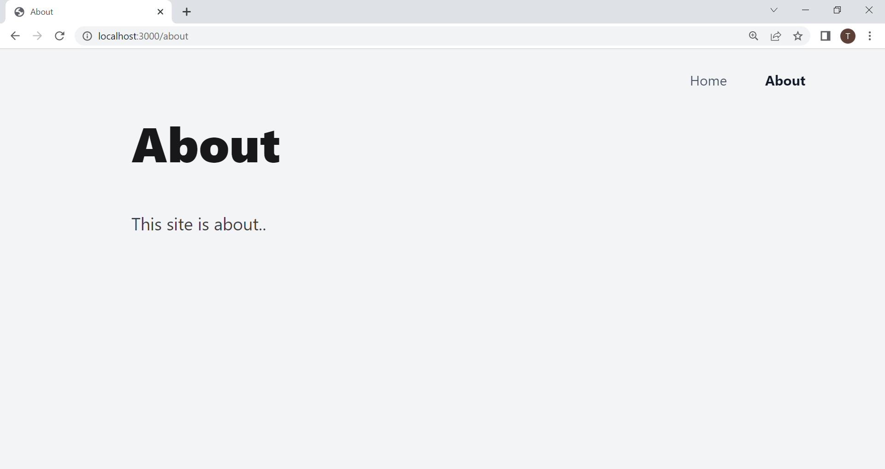
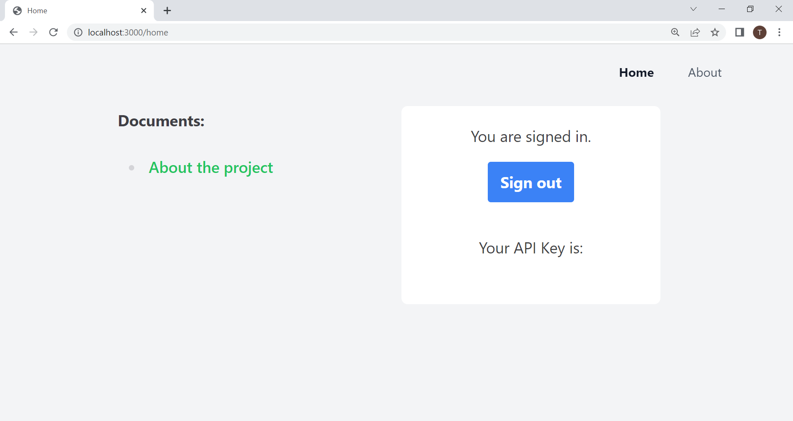
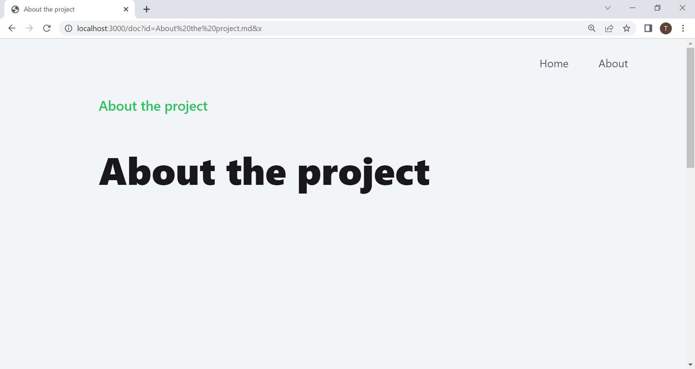

# Sample website to display Obsidian documents

This project is a part of [an open architecture design](https://github.com/tamasmajer/obsidian-publish-to-unstorage-plugin) to publish documents from [Obsidian](https://obsidian.md). As mentioned in the [plugin documentation](https://github.com/tamasmajer/obsidian-publish-to-unstorage-plugin), on this website the user can authenticate, get an API key, and view a published set of documents saved in an intermediary Unstorage server.

## Status

This is a very limited POC version, it needs a proper markdown plugin setup to support the most common ones used in Obsidian. Only external images are supported. The markdown viewer should be customizable, externalizable even.

## About page

## Authentication page

## Markdown viewer

